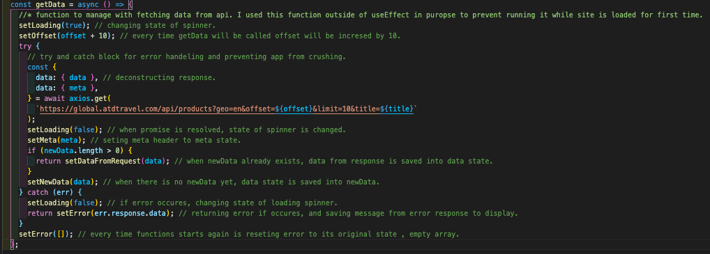
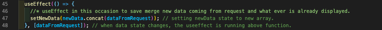

# API Request Test from ATD

## Overview

The main focus of this test was to get a request from a given public API. Each API call has to include a title for searching purposes. Also, the call has a limit and offset parameters. API request has to be ready to make another call with the same title but fetching more data. The data from the call has to be displayed in the app.

## Time to build

### 2 days

---

### Visit FilteringAPP **[here](https://filteringatd.netlify.app/)**!

---

#### Clone or download the repo then do the following in Terminal:

- Go to the root folder and run `yarn` to install all dependencies.
- In the root folder run `yarn star` to start the local server.
- App should run in `http://localhost:3000`. If not, check your terminal for more details.

## Technologies Used

- JavaScript
- React
- Axios
- Bootstrap
- Netlify (for app deployment)

### Development tools:

- VS code
- Yarn
- GitHub
- Google Chrome dev tools, JSON Viewer Pro (Chrome extension for API requests)

# Timeline

## Day 1

### Getting to correct API endpoints and displaying data:

As it was a test based on the API requests, I have to check all the endpoints and what data is coming from it. I had an endpoint address but I have to check how to work with offset and limit parameters in the meta header. For this occasion, I used JSON Viewer Pro for its simplicity and ease of use. It was new for me to use API requests with offset and limit, I spend some time educating myself on this. When the request string was built and tested I started fetching data and displaying it on the app.

The basic style was implemented in the app for testing purposes. The next function to implement was fetching more data and displaying it alongside data fetched previously and being able to repeat these calls till there is no more data to fetch. Unfortunately, it was a blocker. After spending a couple of hours I decided to continue the next day.

## Day 2

### Fixing issues from the previous day and debugging:

I finished the previous day dealing with displaying data that is already displayed and data coming from new requests. After spending a decent amount of time planning how to approach the problem, I decided to give it a go with the `concat()` function which will append one array to another. It was a very good call, simple to use and short coded. While my problem with chaining data was solved, I had to focus on design and conditional rendering.

When I manage to fix all bugs, I get an idea to use a loading spinner while data is fetched from the database. As I have never done it before, I spend some time researching and trying to add it to my app. After a few attempts, I was successful in adding a loading spinner to the app. As I was happy with the functionality and design of the app, I did some small code improvements and deployed the app on the Netlify server.

## Wins & Blockers

### Wins:

Simple API request app but brings me lots of practice and I learnt a few new things which I haven't done before. Gives me the opportunity to better understand how React hooks works and how to manage API calls with offset and limit parameters. Also, on this occasion, I use it for the first time Bootstrap, which was a good experience as well.

### Blockers:

The biggest blocker in this project was displaying previous data with new coming data. I manage to overcome this issue after good research. Also, Bootstrap was bringing some challenging moments as I use it for the first time.

## Bugs

- When user pressing search button for second time, data is fetch with wrong offset.

## Short overview

